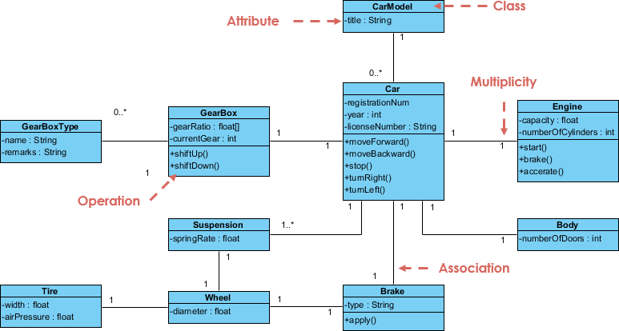

# Introduction to Object-Oriented Design (OOD)

Welcome to the world of object-oriented programming (OOP)! In this first lecture, we'll delve into the fundamental concept of **object-oriented design (OOD)**, which serves as the blueprint for building robust and maintainable software using OOP principles.

## What is OOD?

Imagine a toolbox filled with various tools – wrenches, screwdrivers, hammers, each with a specific function. OOD is like organizing your code into these well-defined tools – **objects**.  Each object has its own **properties** (data) and **behaviors** (functions) that work together to achieve a specific task.

## Why OOD?

* **Real-world modeling:** OOD allows you to represent real-world entities like cars, accounts, or documents as objects, making your code more intuitive.  
For example a shopping cart modelled with properties like capacity, weight and methods like addItem(), removeItem()

* **Modularity:** Objects are self-contained units, promoting code reusability and easier maintenance.
* **Maintainability:** Changes made to one object are less likely to affect others, reducing the risk of unintended consequences.
* **Scalability:** Complex systems can be broken down into smaller, manageable objects, making them easier to expand and modify.

## What will we learn about OOD?

Throughout this course, we'll explore the core principles of OOD, including:

* **Classes and objects:** We'll learn how to define classes as blueprints for creating objects and explore the relationship between them.

* **Data abstraction (encapsulation):** We'll see how to protect an object's internal data by controlling access to its properties and methods.

* **Inheritance:** We'll discover how to create new classes (subclasses) that inherit properties and behaviors from existing ones (parent classes), promoting code reuse.

* **Polymorphism:** We'll explore how objects of different classes can respond differently to the same message, enhancing code flexibility.

## By the end of this course, you'll be able to:

* Apply OOD principles to design and develop object-oriented programs.
* Understand the benefits of using objects, classes, and relationships between them.
* Implement core OOD concepts like encapsulation, inheritance, and polymorphism.
* Break down complex problems into smaller, manageable objects.

This introduction to OOD lays the foundation for your journey into the exciting world of object-oriented programming. Get ready to unleash the power of objects and build robust, maintainable, and scalable software applications!